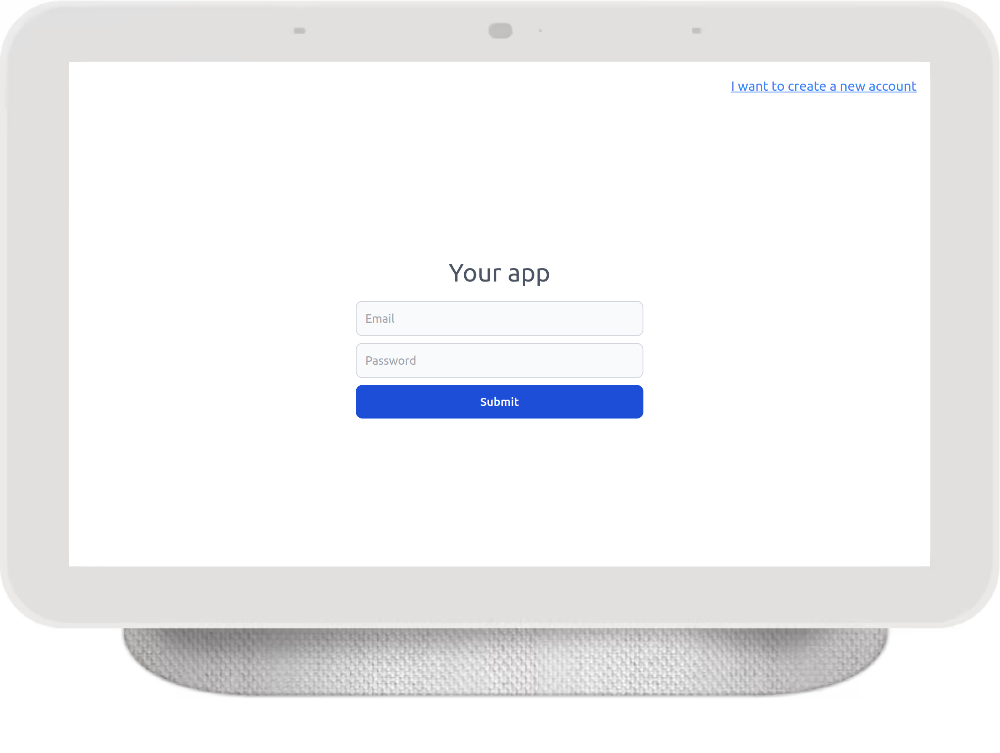

# Meteor Template

Designed with simplicity and functionality in mind, this template provides a user-friendly sign-in and sign-up platform. Thanks to the integration of Tailwind CSS, you have complete control over the visual design, making it effortless to customize the application according to your preferences.


### Preview



Why Choose Meteor QuickStart?
1. Effortless Setup: Say goodbye to time-consuming initial configurations. With pre-configured Accounts and Routes, you can start working on your app's core functionality from day one.

2. Tailwind CSS Integration: Unlock the true potential of Tailwind CSS, a highly customizable and responsive CSS framework. Tailwind CSS empowers you to effortlessly style your application, ensuring it looks stunning on any device.

3. Complete Accounts System: Managing user authentication has never been easier. Our template comes with a robust user authentication system, allowing you to handle user registrations, logins, password resets, and more, with ease and security.

4. Email Sending with SendGrid: Communicate effectively with your users through email notifications, password reset links, and more, using the seamless integration of SendGrid.

5. Token-Based Login: Offer your users a convenient and secure method of logging in with token-based authentication.

6. Meteor Methods for Password Management: Simplify password-related tasks with two Meteor methods dedicated to updating passwords and sending password reset tokens.

7. Environment Variables with settings.json: Safeguard sensitive information using a settings.json file for your environment variables.

8. Authenticated and Unauthenticated Routes: Create a smooth and personalized user experience with separate routes for authenticated and unauthenticated users.


### How to Start

1. Clone the repository to your local machine.
2. Install dependencies using Meteor:
```bash
meteor npm install
```
3. Start the project:
```bash
npm start
```

### Using an External MongoDB

If you prefer to use an external MongoDB for your project, follow these steps:

1. Open the package.json file.
2. Locate the script:
```json
"scripts": {
  "start-with-local-mongodb": "MONGO_URL=mongodb://localhost:27017/DATABASE_NAME",
  ...
}
```
3. Replace `DATABASE_NAME` with the name of your MongoDB database.
4. Ensure you have MongoDB installed correctly on your system and accessible to the project.


### Contributing
We welcome contributions to enhance and improve this template. If you encounter any issues or have ideas for new features, feel free to open an issue or submit a pull request.


Kickstart your Meteor projects with confidence using this template. With Tailwind CSS, a comprehensive Accounts system, and pre-configured Routes, you can focus on building your application's unique features while enjoying the convenience and power of Meteor. Happy coding!
