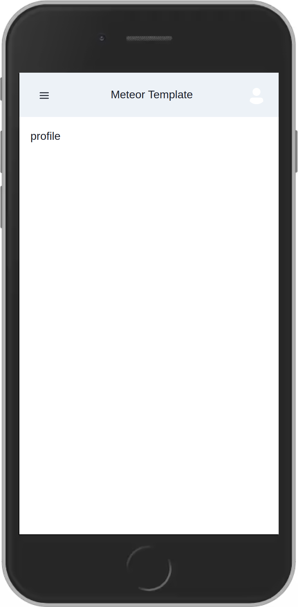

# Meteor Template

Designed with simplicity and functionality in mind, this template provides a user-friendly sign-in and sign-up platform. Thanks to the integration of Chakra UI, you have complete control over the visual design, making it effortless to customize the application according to your preferences.

### Why Choose Meteor QuickStart?

1. Effortless Setup: Say goodbye to time-consuming initial configurations. With pre-configured Accounts and Routes, you can start working on your app's core functionality from day one.
2. Chakra UI Integration: Unlock the true potential of Chakra UI, a highly customizable and accessible component library for React. Chakra UI empowers you to effortlessly style your application, ensuring it looks stunning on any device while providing an excellent user experience.
3. Email Sending with SendGrid: Communicate effectively with your users through email notifications, password reset links, and more, using the seamless integration of SendGrid.
4. Environment Variables with settings.json: Safeguard sensitive information using a settings.json file for your environment variables.
5. Authenticated and Unauthenticated Routes: Create a smooth and personalized user experience with separate routes for authenticated and unauthenticated users.
6. GraphQL Integration with DDP Protocol: Harness the power of GraphQL integration through the DDP (Distributed Data Protocol) to efficiently manage data queries and mutations, optimizing your application's performance.
7. Multi-Language Internationalization: Reach a broader audience by implementing multi-language support, allowing users to experience your application in their preferred language.
8. Google Login Integration: Provide users with a convenient login option using their Google accounts, enhancing accessibility and user satisfaction.
9. Authenticated Routes with GraphQL: Elevate your application by combining authenticated routes with GraphQL, enabling users to interact with personalized data and features securely.

### Chakra UI

To explore the capabilities of Chakra UI and see a live demo, you can visit the official Chakra UI website

- Chakra UI - https://chakra-ui.com/
- Chakra template for free - https://chakra-templates.dev/

### Preview




### GraphQL Integration with DDP Protocol
Harness the power of GraphQL by integrating it with the DDP protocol in Meteor. This combination offers efficient data transfer and real-time updates, optimizing the performance of your application.

### Multi-Language Internationalization
Extend the reach of your application by implementing multi-language support. Users can enjoy a personalized experience by choosing their preferred language for the application interface.

### Google Login Integration
Enhance user accessibility by providing a Google login option. Users can conveniently log in using their Google accounts, streamlining the authentication process.

### How to Start

1. Clone the repository to your local machine.
2. Install dependencies using Meteor:

```bash
meteor npm install
```

### Working with Environment Variables
To ensure the security of sensitive information and provide flexibility in different deployment scenarios, this extended Meteor template employs environment variables. Follow these steps to configure and manage environment variables effectively:

1. Locate the `example.settings.json` file in the `/private/env/dev/` directory of your project.
2. Duplicate the `example.settings.json` file and rename the duplicate as `settings.json`. This file will store your actual environment variables.
3. Open the `settings.json` file and replace each placeholder variable with its corresponding value. This ensures that your application can access the necessary configuration information.

For example, if your settings.json file initially looks like this:

```json
{
  "sendgridAPIKey": "YOUR_SENDGRID_API_KEY",
  "mongoURL": "YOUR_MONGODB_URL"
}
```
Replace **"YOUR_SENDGRID_API_KEY"** with your actual SendGrid API key and **"YOUR_MONGODB_URL"** with your MongoDB URL.
```json
{
  "sendgridAPIKey": "actual_sendgrid_api_key_here",
  "mongoURL": "actual_mongodb_url_here"
}
```

3. Start the project:

```bash
npm start
```

### Using an External MongoDB

If you prefer to use an external MongoDB for your project, follow these steps:

1. Open the package.json file.
2. Locate the script:

```json
"scripts": {
  "start-with-local-mongodb": "MONGO_URL=mongodb://localhost:27017/DATABASE_NAME",
  ...
}
```

3. Replace `DATABASE_NAME` with the name of your MongoDB database.
4. Ensure you have MongoDB installed correctly on your system and accessible to the project.

### Commit Message Convention and Hooks
We follow a commit message convention to maintain a standardized format for commit messages. 
We use commit-lint and husky to enforce this convention and prevent commits that don't adhere to it.


### Contributing

We welcome contributions to enhance and improve this template. If you encounter any issues or have ideas for new features, feel free to open an issue or submit a pull request.

Kickstart your Meteor projects with confidence using this template. With Tailwind CSS, a comprehensive Accounts system, and pre-configured Routes, you can focus on building your application's unique features while enjoying the convenience and power of Meteor. Happy coding!
